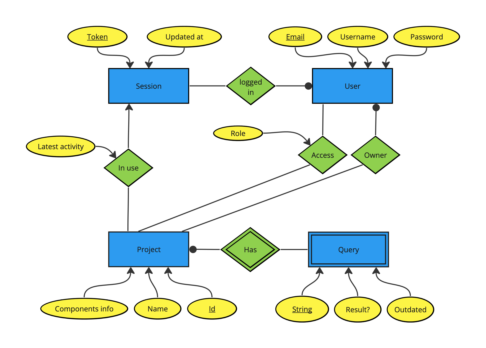
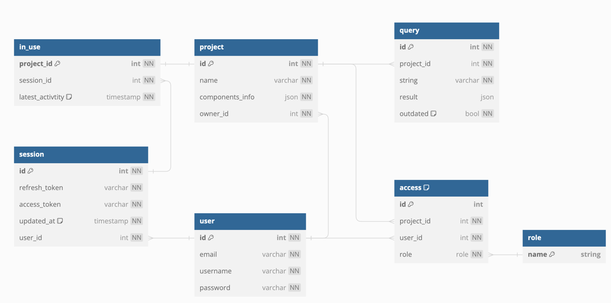

# Ecdar-API

## Description
Ecdar-API serves as the intermediary between the [Ecdar frontend](https://github.com/ECDAR-AAU-SW-P5/Ecdar-GUI-Web) and the [Ecdar backend](https://github.com/ECDAR-AAU-SW-P5/Reveaal) (Reveaal). Its core functionality revolves around storing and managing entities such as users and projects, allowing the backend to focus solely on computations.

The API exposes two GRPC services, namely `EcdarBackend` and `EcdarApi`, both defined in the [Ecdar protobuffers](https://github.com/ECDAR-AAU-SW-P5/Ecdar-ProtoBuf):
- The frontend application can contact the backend application as normally, through the `EcdarBackend` service.
- The frontend application can use the `EcdarApi` service to manage entities.
## Entities

The following ER diagram encapsulates the high-level description of entities, driven by these specific requirements:

- Users possess a unique email, a unique username, and a hashed password.
- Users can create projects that they own.
- Owners can share projects with other users, granting different access rights.
- User login initiates a session with a token and creation time.
- Sessions expire or are deleted when users log off.
- Projects can only be edited by one user session at a time.
- Inactivity during project editing allows other users to take over.
- A project comprises a name, a JSON/XML component representation, and multiple queries.
- Queries store strings and results, marking them as outdated if the associated project is edited.

Leading to the following [schema diagram](https://dbdiagram.io/d/Copy-of-Copy-of-Ecdar-db-657077c556d8064ca0817d31).

Ecdar-API offers implementations for both `postgreSQL` and `sqlite` databases.

## Development

**Prerequisites:**
- Install [rust/cargo](https://www.rust-lang.org/tools/install).
- Install Docker and Docker Compose (both come with [Docker Desktop](https://www.docker.com/products/docker-desktop/)).
- Install [sea-orm-cli](https://www.sea-ql.org/SeaORM/docs/generate-entity/sea-orm-cli/) (`cargo install sea-orm-cli`).
- Set up an `.env` file by copying and configuring `.env.example`.

**Set up Docker PostgreSQL DB:**
- Run `docker-compose up -d` to create two PostgreSQL databases (one for testing).
- Run `sea-orm-cli migrate up` to migrate the db-schema (requires `DATABASE_URL` in `.env`).

**After modifying migration files:**
- Run `sea-orm-cli migrate fresh` to drop and reapply all migrations.
- Run `sea-orm-cli generate entity -o src/entities` to regenerate the files in `src/entities`.

**Run tests:**
- Execute `cargo test -- --test-threads=1`.

**Simulating Frontend:**
- Ecdar-API can be contacted via GRPC from [Postman](https://www.postman.com/).
- Useful for integration testing.
- No shared Postman collection currently exists.
- Follow [this guide](https://learning.postman.com/docs/sending-requests/grpc/grpc-request-interface/) to create custom requests.